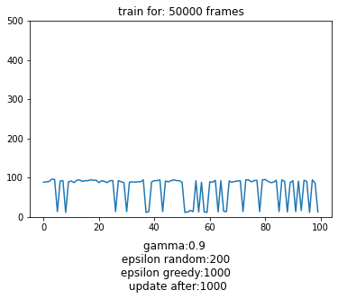

# Cartpole results

## Two approaches:
- [Keras-rl](https://github.com/keras-rl/keras-rl)
- Manual implementation of training 

Results from keras-rl:
    
  

  
   

Results from keras manual training:

Benefits of using keras manual training:
 - Better understading of the underlying technology and setup. More controll over the process and variables.
Benefits of keras-rl:
- Faster and easier to implement.
